% Hadoop for HPCers:A Hands-On Introduction
% Jonathan Dursi, SciNet and Mike Nolta, CITA
% Part I: Overview,HDFS


##Agenda

* High Level Overview
* Hadoop FS
* Map Reduce
* Hadoop MR + Python
* Pig
* YARN; Spark

##Let's Get Started!

* Fire up your course VM
* Open terminal; type

```
source bin/init.sh
cd wordcount/streaming
make
```
* You've run your (maybe) first Hadoop job!


## Hadoop

* 2007 OSS implementation of 2004 Google MapReduce paper
* Originally consisted of distributed filesytem HDFS, core runtime, an implementation of Map-Reduce.
* Hardest to understand for HPCers: Java
* We'll mainly be working in Python


## Hadoop Ecosystem
* 2008+ - usage exploded
* Creation of *many* tools building atop Hadoop infrastructure
* Met a real need

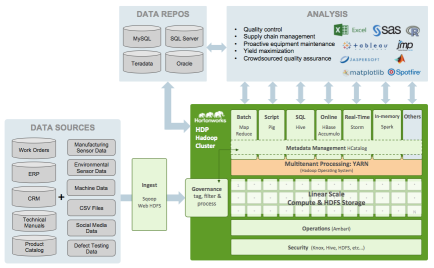

## Data Intensive Computing
* Data volumes increasing massively
* Clusters, storage capacity increasing massively
* Disk speeds are not keeping pace.
* Seek speeds even worse than read/write

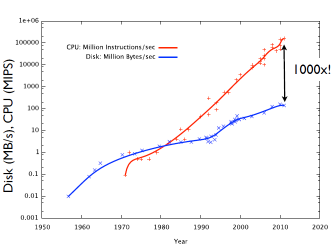

## Scale-Out

* Disk streaming speed ~ 50MB/s
* 3TB =17.5 hrs
* 1PB = 8 months
* Scale-out (weak scaling) - filesystem distributes data on ingest
* Seeking too slow
    * ~10ms for a seek
    * Enough time to read half a megabyte
* Batch processing
* Go through entire data set in one (or small number) of passes


## Combining results

* Each node preprocesses its local data
* Shuffles its data to a small number of other nodes
* Final processing, output is done there


## Fault Tolerance

* Data also replicated upon ingest
* Runtime watches for dead tasks, restarts them on live nodes
* Re-replicates


## What is it good at?

* "Classic" Hadoop 1.x is all about batch processing of massive amounts of data
* (Not much point below ~1TB)
* Map-Reduce is relatively loosely coupled; one "shuffle" phase.
* Very strong weak scaling in this model - more data, more nodes.
* Batch: process all data in one go w/classic Map Reduce
* (Current Hadoop has many other capabilities besides batch - more later)


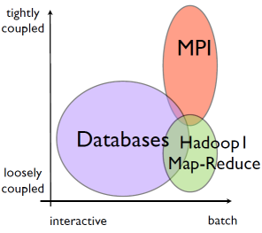

* Compare with databases - very good at working on small subsets of large databases
* DBs - very interactive for many tasks
* DBs - have been difficult to scale
* Compare with HPC (MPI)
* Also typically batch
* Can (and does) go up to enormous scales
* Works extremely well for very tightly coupled problems: zillions of iterations/timesteps/ exchanges.

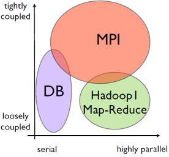

## Hadoop vs HPC

* We HPCers might be tempted to an unseemly smugness.
* "They solved the problem of disk-limited, loosely-coupled, data analysis by throwing more disks at it and weak scaling? Ooooooooh."
* We'd be wrong.
* A single novice developer can write real, scalable, 1000+ node data-processing tasks in Hadoop-family tools in an
afternoon.
* MPI... less so.


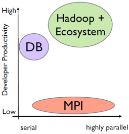

## Data Distribution: Disk

* Hadoop and similar architectures handle the hardest part of parallelism for you - data distribution.
* On disk: HDFS distributes, replicates data as it comes in
* Keeps track; computations local to data


## Data Distribution: Network

* On network: Map Reduce (eg) works in terms of key-value pairs.
* Preprocessing (map) phase ingests data, emits (k,v) pairs 
* Shuffle phase assigns reducers, gets all pairs with same key onto that reducer.
* Programmer does not have to design communication patterns

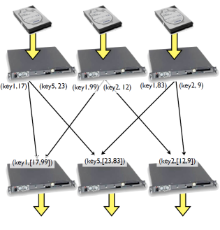

## Makes the problem easier

* Decomposing the problem, and,
* Getting the intermediate data where it needs to go,
* ... are the hardest parts of parallel programming with HPC tools.
* Hadoop does that for you automatically for a wide range of problems.


## Built a reusable substrate

* The filesystem (HDFS) and the MapReduce layer were very well architected. 
* Enables many higher-level tools
* Data analysis, machine learning, NoSQL DBs,...
* Extremely productive environment
* And Hadoop 2.x (YARN) is now much much more than just MapReduce


## Hadoop and HPC
* Not either-or anyway
* Use HPC to generate big / many simulations, Hadoop to analyze results
* Use Hadoop to preprocess huge input data sets (ETL), and HPC to do the tightly coupled computation afterwards.
* Besides, ...

### 1: Everything's Converging

* These models are all converging at the largest scales
* Good ideas are good ideas. 
* MPI is trying to grow fault tolerance (but MPI codes?)
* Relational DBs are scaling up
* People are building tools for tightly coupled computation atop Hadoop-like frameworks 
* Hadoop is growing tightly coupled *much* faster than MPI codes are growing fault tolerance (cf. Spark, Giraph...)

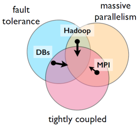

### 2: Computation is Computation

* These models of computation aren't that different
* Different problems fall in different models' "sweet spots".
* Will look at some numerical computation examples:
    * Distributed 1d diffusion PDE
    * non-linear least squares
    * sparse matrix multiplication
* And Hadoop 2.x allows models of computation much beyond MapReduce.

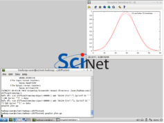

## Hadoop Job Workflow
* Let's take a look at the Makefile in the wordcount example
* Three basic tasks; building program; copying files in; running; getting output
* Building program; compile to bytecode against the current version of Hadoop
* Build a .jar file which contains all the relevant classes; this .jar file gets shipped off in its entirety to workers
* Running the program: must first copy the input files onto the Hadoop file system ( hdfs dfs -put )
* Remove ( hdfs dfs -rm -r ) the output directory if it exists
* Run the program by specifying the input jar file and the class of the program, and give it any arguments
* Type out (cat) the output file.

```
INPUT_DIR   = /user/$(USER)/wordcount/input
OUTPUT_DIR  = /user/$(USER)/wordcount/output
OUTPUT_FILE = $(OUTPUT_DIR)/part-00000

CLASSPATH=$(shell hadoop classpath)

run: wordcount.jar
    hadoop dfs -test -e $(INPUT_DIR)/file01 \
      || hadoop dfs -put ../input-small/file01 $(INPUT_DIR)/file01
    hadoop dfs -test -e $(INPUT_DIR)/file02 \
      || hadoop dfs -put ../input-small/file02 $(INPUT_DIR)/file02
    -hadoop dfs -rmr $(OUTPUT_DIR)
    hadoop jar wordcount.jar org.hpcs2013.WordCount \
           $(INPUT_DIR) $(OUTPUT_DIR)
    hadoop dfs -cat $(OUTPUT_FILE)

wordcount.jar: WordCount.java
    mkdir -p wordcount_classes
    javac -classpath $(HADOOP_PREFIX) -hadoop-core-$(HADOOP_VERSION).jar \
          -d wordcount_classes WordCount.java
    jar -cvf wordcount.jar -C wordcount_classes .

clean:
    -rm wordcount.jar
    -rm -r wordcount_classes
    -hadoop dfs -rmr $(INPUT_DIR)
    -hadoop dfs -rmr $(OUTPUT_DIR)  

.PHONY: clean run

```

## The Hadoop Filesystem

* HDFS is a distributed parallel filesytem
* Not a general purpose file system
    * doesn't implement posix
    * can't just mount it and view files
* Access via "hdfs dfs" commands
* Also programatic APIs
* Security slowly improving

**hdfs dfs -[cmd]**

----|-------
cat|chgrp
chmod|chown
copyFromLocal|copyToLocal
cp|du
dus|expunge
get|getmerge
ls|lsr
mkdir|movefromLocal
mv|put
rm|rmr
setrep|stat
tail|test
text|touchz

## The Hadoop Filesystem

* Required to be:
    * able to deal with large files, large amounts of data
    * scalable
    * reliable in the presence of failures
    * fast at reading contiguous streams of data
    * only need to write to new files or append to files
    * require only commodity hardware

* As a result:
    * Replication
    * Supports mainly high bandwidth, *not* especially low latency
    * No caching (what's the point if primarily for streaming reads)
    * Poor support for seeking around files
    * Poor support for zillions of files
    * Have to use separate API to see filesystem
    * Modelled after Google File System (2004 Map Reduce paper)


## Blocks in HDFS

* HDFS is a block-based file system.
* A file is broken into blocks, these blocks are distributed across nodes
* Blocks are large; 64MB is default, many installations use 128MB or larger
* Large block size - time to stream a block much larger than time disk time to access the block.
* hdfs fsck / -files -blocks lists all blocks in all files.

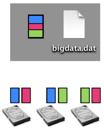

## Datanodes and Namenode

* Two different types of nodes in the filesystem
* Namenode - stores all metadata and block locations in memory.
    * Metadata updates are stored to persistent journal
    * Lots of files bad
* Datanodes - store and retrieve blocks for client or namenode
* Newer versions of Hadoop - federation (different namenodes for /user, /data, / project , etc)
* Newer versions of Hadoop - High Availability namenode pairs

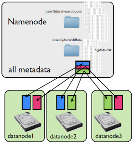

## Writing a file

* Writing a file multiple stage process
* Create file
* Get nodes for blocks
* Start writing
* Data nodes coordinate replication
* Get ack back
* Complete

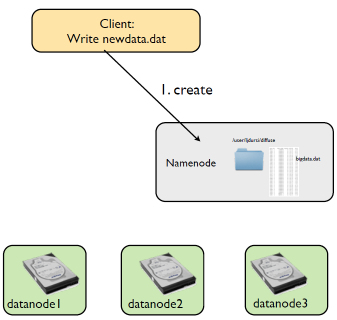

----------

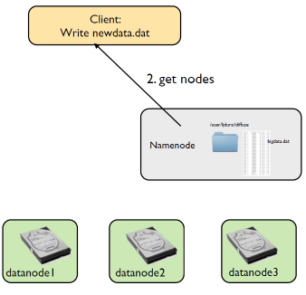

----------

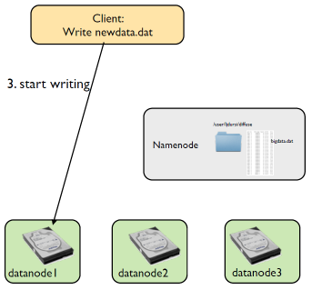

----------

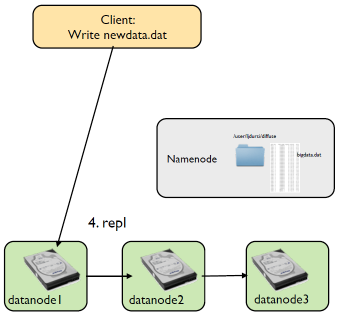

----------

* Get ack back (while writing)

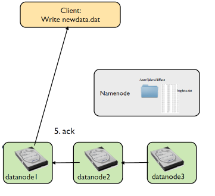

----------

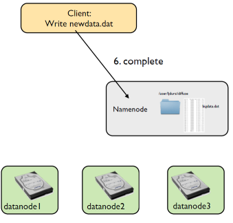

## Where to Replicate?

* Tradeoff to choosing replication locations
* Close: faster updates, less network bandwidth
* Further: better failure tolerance
* Default strategy: first copy on different location on same node, second on different "rack"(switch), third on same rack location, different node.
* Strategy configurable.
* Need to configure Hadoop file system to know location of nodes

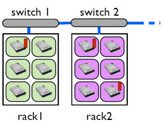

## Reading a file

* Reading a file shorter
    * Get block locations
    * Read from a replica
    
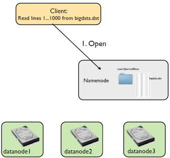

----------
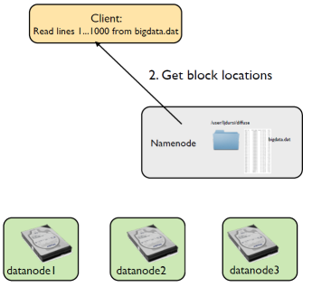

----------
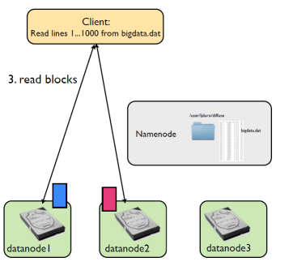

## Configuring HDFS

* Need to tell HDFS how to set up filesystem
* data.dir, name.dir - where on local system (eg, local disk) to write data
* parameters like replication - how many copies to make
* default name - default file system to use
* Can specify multiple FSs

**$HADOOP_PREFIX/etc/hadoop/core-site.xml**

```
<configuration>
<property>
<name>fs.defaultFS</name>
<value>hdfs://your.server.name.com:9000</value>
</property>

<property>
<name>dfs.data.dir</name>
<value>/home/username/hdfs/data</value>
</property>

<property>
<name>dfs.name.dir</name>
<value>/home/username/hdfs/name</value>
</property>

<property>
<name>dfs.replication</name>
<value>3</value>
</property>
</configuration>
```

* For us:
    * Only one node to be used, our laptops
    * default: localhost

```
<configuration>

<property>
<name>fs.defaultFS</name>
<value>hdfs://localhost:9000</value>
</property>

</configuration>
```

* Since only one node, need to specify replication factor of 1, or will always fail

```
<configuration>
. . .
<property>
<name>dfs.replication</name>
<value>1</value>
</property>
. . .
</configuration>
```

* Also need to make sure that environment variables are set
* path to Java, path to Hadoop

**~/.bashrc**

```
...
!
export JAVA_HOME=/usr/lib/jvm/default-java
export HADOOP_VERSION=2.3.0
export HADOOP_PREFIX=/path/to/hadoop-${HADOOP_VERSION}
!
...
```

**$HADOOP_PREFIX/etc/hadoop/hadoop-env.sh**

```
...
!
export JAVA_HOME=/usr/lib/jvm/default-java
!
...
```

```
ssh-keygen -t dsa -P '' -f ~/.ssh/id_dsa
$ cat ~/.ssh/id_dsa.pub >> ~/.ssh/authorized_keys
```

* Finally, have to make sure that passwordless login is enabled
* Can start processes on various FS nodes

**Done for you in init.sh**

```
. . .
$ hdfs namenode -format
$ start-dfs.sh
. . .
```
* Once configuration files are set up, can format the namenode like so
* Then you can start up just the file systems:

## Using HDFS

* Now once the file system is up and running, you can copy files back and forth
* get/put, copyFromLocal/ copyToLocal
* Default directory is /user/${username}
* Nothing like a "cd"


## Using HDFS Hands On

* In ~/hdfs-test, follow directions in README: From shell,
    * create a directory
    * copy (put) a file
    * list a directory
* Can also browse file system via web interface:

  http://vm-ip:50070/explorer.html

eg

 http://192.168.33.10:50070/explorer.html

```
hdfs dfs -mkdir /user/hadoop-user/hdfs-test
hdfs dfs -ls /user/hadoop-user
hdfs dfs -ls /user/hadoop-user/hdfs-test
hdfs dfs -put data.dat /user/hadoop-user/hdfs-test
hdfs dfs -ls /user/hadoop-user/hdfs-test
```

* In general, the data files you send to HDFS will be large (or else why bother with Hadoop)
* Don't want to be constantly copying back and forth - view, append "in place"
* Several APIs to accessing the HDFS -Java, C++, Python
* Here, we use one to get a file's status,and read some data from it at some given offset

**hdfs-test/readfile.py**

```
from pywebhdfs.webhdfs import PyWebHdfsClient

hdfs = PyWebHdfsClient(host='localhost',port='50070',user_name='vagrant')
my_file = 'user/vagrant/hdfs-test/data.dat'

print 'Status of file: ', my_file
status = hdfs.get_file_dir_status(my_file)
print status

print 'Second 500 bytes of file: ',my_file
data = hdfs.read_file(my_file,offset=500,length=500)

print data

```

# Part II: MapReduce

## Hadoop MR Job Workflow

```
WordCount.java
    mkdir -p wordcount_classes
    javac -classpath $(CLASSPATH) -Xlint:deprecation \
          -d wordcount_classes WordCount.java
    jar -cvf wordcount.jar -C wordcount_classes .
```

* Building the program
* Running a "Map Reduce" program...

## MapReduce

* Two classes of compute tasks: a Map and a Reduce
* Map processes one "element" at a time, emits results as (key, value) pairs.
* All results with same key are gathered to the same reducers
* Reducers process list of values, emit results as (key, value) pairs.

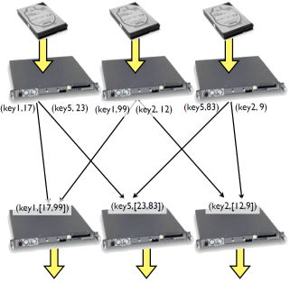

## Map

* All coupling is done during the "shuffle" phase
* Embarrassingly parallel task - all map
* Take input, map it to output, done.
* (Famous case: NYT using Hadoop to convert 11 million image files to PDFs - almost pure serial farm job)


## Reduce

* Reducing gives the coupling
* In the case of the NYT task, not quite embarrassingly parallel; images2 from multi-page articles
* Convert a page at a time, gather images2 with same article id onto node for conversion.

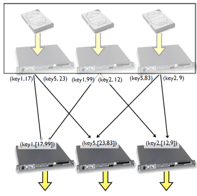

## Shuffle

* The shuffle is part of the Hadoop magic
* By default, keys are hashed and hash space is partitioned between reducers
* On reducer, gathered (k,v) pairs from mappers are sorted by key, then merged together by key
* Reducer then runs on one (k,[v]) tuple at a time
* If you do know something about the structure of the problem, can supply your own partitioner
* Assign keys that are "similar" to each other to same node 
*  Reducer still only sees one (k, [v]) tuple at a time.


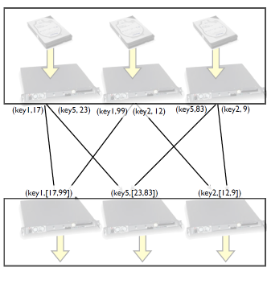

## Word Count

* Was used as an example in the original MapReduce paper
* Now basically the "hello world" of map reduce
* Do a count of words of some set of documents.
* A simple model of many actual web analytics problem
* How would you do this with a huge document?
* Each time you see a word, if it's a new word, add a tick mark beside it, otherwise add a new word with a tick
* ...But hard to parallelize (updating the list)


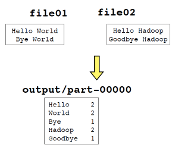

* MapReduce way - all hard work is done by the shuffle - eg, automatically.
* Map: just emit a 1 for each word you see

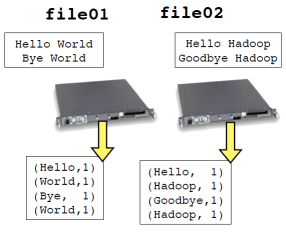

* Shuffle assigns keys (words) to each reducer, sends (k,v) pairs to appropriate reducer
* Reducer just has to sum up the ones

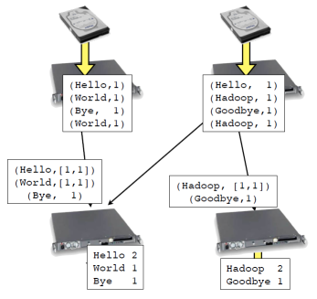

## Hadoop Job Workflow

```
WordCount.java
    mkdir -p wordcount_classes
    javac -classpath $(CLASSPATH) -Xlint:deprecation \
          -d wordcount_classes WordCount.java
    jar -cvf wordcount.jar -C wordcount_classes .
```

* Building the program
* Class is expected to have particular methods
* Let's look at WordCount.java

## main()

* The main() routine in a apReduce computation creates a Job with a Configuration
* Set details of Input/Output, etc
* Then runs the job.

```
public class WordCount {
 /* ... */

 public static void main(String[] args) throws Exception {

    if (args.length != 2) {
      System.err.println("Usage: wordcount <in> <out>");
      System.exit(2);
    }

    Job job = Job.getInstance(new Configuration());
    job.setJobName("wordcount");
    job.setJarByClass(WordCount.class);

    job.setMapperClass(Map.class);
    job.setCombinerClass(Reduce.class);
    job.setReducerClass(Reduce.class);

    job.setOutputKeyClass(Text.class);
    job.setOutputValueClass(IntWritable.class);

    FileInputFormat.setInputPaths(job, new Path(args[0]));
    FileOutputFormat.setOutputPath(job, new Path(args[1]));

    job.submit();
    job.waitForCompletion(true);
  }
}
```

* The heart of doing work in Hadoop originally was MapReduce 
* Create a Map routine and a Reduce routine
* Wire those into the job.
* (Reduce is optional)


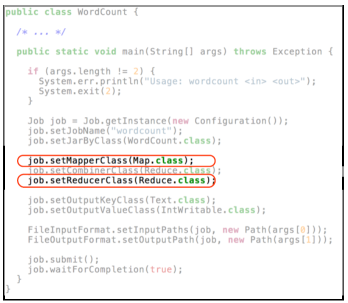

# Python/Hadoop count

* Before looking at the Java, let's look at a language probably more familiar to most of us.
* A mapper task - just reads the stdin stream pointed at it, spits out tab-separated lines (word,1)

```
#!/usr/bin/env python

import sys

for line in sys.stdin:
    line = line.strip()

    words = line.split()
    for word in words:
        print '%s\t%s' % (word, 1)

```

* A simple reducer
* gets partitioned sorted streams of
    - (Hello,1)
    - (Hello,1)
    - (Goodbye,1)
* and sums the counts
* prints (word,sum) at end

```
#!/usr/bin/env python
import sys

current_word = None
current_count = 0
word = None

for line in sys.stdin:
    line = line.strip()

    word, count = line.split('\t', 1)
    count = int(count)

    if current_word == word:
        current_count += count
    else:
        if current_word:
            print '%s\t%s' % (current_word, current_count)
        current_count = count
        current_word = word

if current_word == word:
    print '%s\t%s' % (current_word, current_count)

```

* Can use this approach in serial using standard shell tools:

```
$ cd wordcount-streaming

$ cat input/*
Hello World Bye World
Hello Hadoop Goodbye Hadoop

$ cat input/* | ./map.py
Hello 1
World 1
Bye 1
World 1
Hello 1
Hadoop 1
Goodbye 1
Hadoop 1

$ cat input/* | ./map.py | sort
Bye 1
Goodbye 1
Hadoop 1
Hadoop 1
Hello 1
Hello 1
World 1
World 1

$ cat input/* | ./map.py | sort | ./reduce.py
Bye 1
Goodbye 1
Hadoop 2
Hello 2
World 2
```

* Can also fire this off in parallel with Hadoop
* "streaming interface", designed to work with other languages

```
$ hadoop jar $(STREAMING_DIR)hadoop-streaming-$(HADOOP_VERSION).jar \
    -files ./map.py,./reduce.py \
    -mapper ./map.py -reducer ./reduce.py \!
    -input $(INPUT_DIR) \!
    -output $(OUTPUT_DIR)

```

* Other interfaces for more programatic interfaces (Pipes - C++; mrjob/pydoop/... - better Python interface, etc)
* Streaming seems to work roughly as well or better if can live with text data

## Number of mappers

* Mapping is tightly tied to the Hadoop file system
* Block-oriented
* "Input splits" - blocks of underlying input files
* One mapper handles all the records in one split
* One mapper per input split
* Only one replica is mapped usually (but fault tolerance)


## Mapper and I/O

* The code for your mapper processes one record
* The map process executes it for every record in the split
* It gets passed in one (key, value) pair, and updates an "Output Collector" with a new (key, value) pair.

```

  public static class Map extends MapReduceBase implements Mapper<LongWrtitable, Text, Text, IntWritable> {

    private final static IntWritable one = new IntWritable(1);
    private Text word = new Text();

    
    public void map(LongWrtitable key, Text value, OutputCollector<Text, IntWritable> output, Reporter reporter) 
        throws IOException {
      String line = value.toString();
      StringTokenizer tokenizer = new StringTokenizer(line);
      while (tokenizer.hasMoreTokens()) {
        word.set(tokenizer.nextToken());
        output.collect(word, one);
      }
    }
  }

```

* The code for your mapper processes one record
* The map process executes it for every record in the split
* In streaming, record == line of text
* It gets passed in one (key, value) pair, and output with a new (key, value) pair.

```
#!/usr/bin/env python

import sys

for line in sys.stdin:
    line = line.strip()

    words = line.split()
    for word in words:
        print '%s\t%s' % (word, 1)

```

* Mapper works one record at a time
* That means the input file format must have a way to indicate "end of record". 
* We're going to be using plain text file, because easy to understand, but there are others (often more appropriate for our examples)


* If record crosses block boundary, must be sent across network
* Another good reason for large blocks - small fraction of data has to be sent
* Mappers can work with compressed a files 
* But obviously works best if the compression algorithm is "splittable" - do you need to read the whole file to understand a chunk?
* bzip2 - slow but splittable
* Other possibilities


## Quick Quiz

* The command to the right isn't quite an accurate model of how the Hadoop streaming job is run
* One mapper per file (and per split if large files)
* What would be a better command-line equivalent? (Assume one reducer)

```
$ cat input/* | ./map.py | \
sort | ./reduce.py
Bye 1
Goodbye 1
Hadoop 2
Hello 2
World 2
```

## Mapper and I/O

* In full Hadoop API, mapper doesn't explicitly do any I/O 
* Input is wired up at job configuration time
* FileInputFormat.setInputPaths will set Input format and input paths

```
public class WordCount {
 /* ... */

 public static void main(String[] args) throws Exception {

    if (args.length != 2) {
      System.err.println("Usage: wordcount <in> <out>");
      System.exit(2);
    }

    Job job = Job.getInstance(new Configuration());
    job.setJobName("wordcount");
    job.setJarByClass(WordCount.class);

    job.setMapperClass(Map.class);
    job.setCombinerClass(Reduce.class);
    job.setReducerClass(Reduce.class);

    job.setOutputKeyClass(Text.class);
    job.setOutputValueClass(IntWritable.class);

    FileInputFormat.setInputPaths(job, new Path(args[0]));
    FileOutputFormat.setOutputPath(job, new Path(args[1]));

    job.submit();
    job.waitForCompletion(true);
  }
}
```

## Reducer and I/O

* Similarly, reducer doesn't explicitly do any I/O
* job.setOutputKeyClass will set the output format, and the output Key/Value types that will be written.
* FileOutputFormat.setOutputPath will send output to an OutputCombiner, and output gets sent out.
* At the end, each reducer writes out its own file, part-N

## Number of reducers

* Number of mappers set by input splits
* Can *suggest* reducing that
* Set of reducers is by default chosen based on input size amongst other things 
* Our problems here - always so small that only one is used (only part-00000)

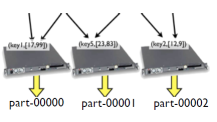 

* Can explicitly set number of reduce tasks
* Try this - in streaming example, do make run-2reducers
* or in WordCount.java, main, add line job.setNumReduceTasks(2);
* Different reducers get different words (keys), different outputs from these keys
* hdfs dfs -getmerge : gets all files in a directory and cat's them

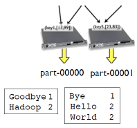

## MapReduce in Java

* In a strongly typed language, we ave to pay a bit more attention to types than with just text streams
* Everything's a key-value pair, but don't have to have same type.
* In our examples, always using TextInputFormat, so (k1,v1) is always going to be Object (line # w/in split) and Text, but others could change

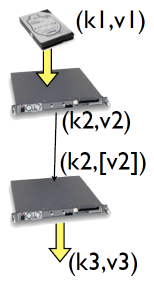

* Input types determined input format
* Reduce outputs specified by the Output Key/Value classes
* If not specified, assumed output of mapper (=input of reduce) same as output of reduce. (k2=k3, v2=v3)

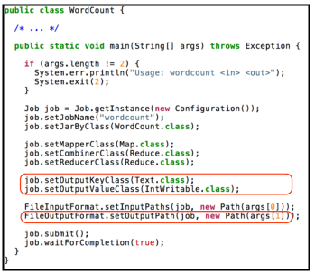

## Map in Java

* Map implements Mapper<k1,v1,k2,v2>
* Note "special" types - IntWritable, not Integer; Text, not String
* Hadoop comes with its own set of classes which "wrap" standard classes but implement Write methods
for serialization (to network or disk).
* k2,v2 - Text, IntWriteable
* eg, ("word", 1)
* Actual work done is very minimal;
* Get the string out of the Text value;
* Tokenize it (split it by spaces)
* While there are more tokens,
* emit (word,one)

```
public static class Map 
      extends Mapper<Object, Text, Text, IntWritable> {

    private final static IntWritable one = new IntWritable(1);
    private Text word = new Text();

    @Override
    public void map(Object key,
                    Text value,
                    Context context) 
        throws IOException, InterruptedException {
      String line = value.toString();
      StringTokenizer tokenizer = new StringTokenizer(line);
      while (tokenizer.hasMoreTokens()) {
        word.set(tokenizer.nextToken());
        context.write(word, one);
      }
    }
  }
```

## Reduce in Java

* k2,v2 - Text, IntWriteable (check)
* k3,v3 also Text,IntWriteable
* Incoming values for a given key are pre-concatenated into an iterable
* (couldn't do this for streaming interface; don't know enough about structure of keys/values. )
* Work is very simple.
* Operates on a single (k,[v]).
* Loop over values (have to .get() the Integer from the IntWritable)
* sum them up
* Make a new IntWritable with value from sum
* Collect (key,sum)

```
public static class Reduce 
    extends Reducer<Text, IntWritable, Text, IntWritable> {

    @Override
    public void reduce(Text key,
                       Iterable<IntWritable> valueList,
                       Context context)
           throws IOException, InterruptedException {
      int sum = 0;
      Iterator<IntWritable> values = valueList.iterator();
      while (values.hasNext()) {
        sum += values.next().get();
      }
      context.write(key, new IntWritable(sum));
    }
  }

```

## Combiners

* One more useful thing to know
* You can have a "combiner".
* Run by each mapper on the output of the mapper, before its fed to the shuffle.
* Required (k2,[v2])->(k2,v2)


* One more useful thing to know
* You can have a "combiner".
* Run by each mapper on the output of the mapper, before its fed to the shuffle.
* Required (k2,[v2])->(k2,v2)
* Dumb to send every (the,1) over the network; combine lets you collate the output of each mapper individually
before feeding to reducers


* In this case, the combiner is just the reducer
* Not all problems lend themselves to the obvious use of a combiner, and in general it won't be identical to the reducer.
* If reducer is commutative and associative, can use as the combiner.


## Web Monitor

* Open browser on laptop 
* go to (e.g.) http://192.168.33.10:8088
* Look at the previous jobs run
* Hadoop has to keep track of the running of individual map, reduce tasks and job status for fault-tolerance reasons
* Presents a nice web interface to the hadoop cluster

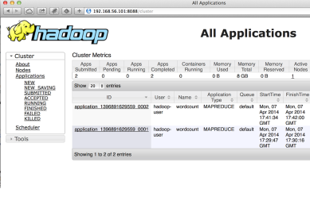

## Map Reduce for Data Exploration


* Recall: assumption is data is very large (at least multiple TB)
* Don't want to make many passes through it.
* Many important initial data exploration tasks fit well into map-reduce framework with one or few passes.
* Consider simple summary statistics like min/mean/max:

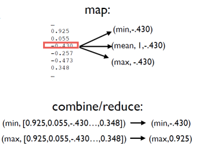

## Histograms

* How about histogram?
* If knew bin locations, pretty easy- exactly like word count
    * mapper calculates bin (key)
    * emit (key, 1)
    * combiner/reducer sums counts
* But normally you want to make histogram from smallest to largest; how do you do that here? Can't calculate min/max and assign bins at the same


## Chained MR jobs

* Run two MR jobs.
* Min/Mean/Max - find extent of data
* Histogram - assign bins based on Min/Mean/Max, # of desired bins.
* Downside: 2 passes through data

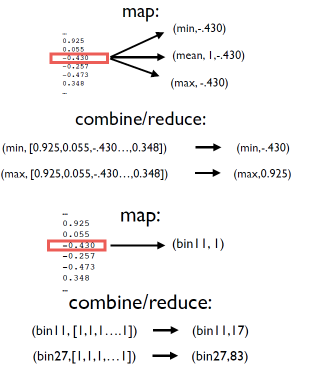

## Distributed cache

* Can send additional files out to mappers/reducers
* Task can then read in to memory and use
* Should be small!
* Here, nbins + min/max data is enough to let us calculate the bin #.

```
hadoop jar $(TOOLLIBS_DIR)/hadoop-streaming-$(HADOOP_VERSION).jar \
        -files ./hist-map.py,./hist-combine-reduce.py,./nbins,./mmm \
        -mapper ./hist-map.py  -combiner ./hist-combine-reduce.py \
            -reducer ./hist-combine-reduce.py \
        -input $(INPUT_DIR) \
        -output  $(OUTPUT_DIR)

```

* Data is read at initialization time of the map task
* From there, get dx, xmim 
* |(x-xmin)/dx| = bin num.

```
#!/usr/bin/env python
import sys
import numpy

# read parameters from distributed cache - nbins, minmeanmax
f = open('nbins','r')
params = f.readline().strip().split()
nbins = int(params[0])
f.close()

f = open('mmm','r')
params = f.readline().strip().split()
xmin = float(params[1])
params = f.readline().strip().split()
params = f.readline().strip().split()
xmax = float(params[1])
f.close()

dx = (xmax-xmin)/nbins

```
## Histogram example

```
$ make run-test!
cat input/small-data.dat | ./mmm-map.py | ./mmm-combine.py \!
! ! | sort | ./mmm-reduce.py > mmm!
cat mmm!
max! 1.759767!
mean!0.014911!
min! -2.153456!
cat input/small-data.dat | ./hist-map.py | \!
! ! ./hist-combine-reduce.py | sort -n | ./hist-combine-reduce.py!
-2.023015! 1!
-1.762134! 2!
-1.501252! 8!
-1.240371! 43!
-0.979489! 133!
-0.718608! 381!
-0.457726! 695!
-0.196844! 947!
0.064037! 1021!
0.324919! 861!
0.585800! 531!
0.846682! 254!
1.107563! 92!
1.368445! 25!
1.629326! 6
```

## Median?

* Mean was pretty straightforward 
* How about something like median?
* Normal approach: sort, take middle element
* Can't have entire data set ni memory
* Sort _all_ billion data points to get one number?

```
...
0.925
0.055
-0.430
-0.257
-0.473
0.348
...
```

* Very effective approximate approach: Median of Medians
* Partition list into groups of 5 (say); find median of those
* Then find median of those numbers...
* Amount of data read/written:

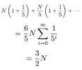

* Lots of job startups, but amount of I/O quite reasonable

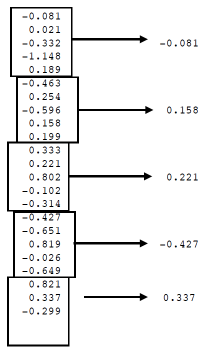

## One or few-pass

* As data volumes get larger, more important to be able to process data in a single pass, or at least with O(N) amount of data read/written
* "Online" or "streaming" algorithms have been an active topic of research - many exist and are already coded up.
* Even simple ones are subtle! Randomly select items with equal priority without knowing before hand how many items there are - reservoir

## Ordinary Least-Squares

* (eg, linear least squares)
* A very simple starting point for examining data given a model
* Here we'll fit a simple linear model (linear regression)
* cd ~/examples/ols/1d!
* make

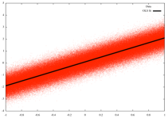

## 1d Least-Squares Linear regression

* Final results - a and b - are simple sums of values evaluated at each point.
* Need sum(x), sum(y), sum(xy), sum(x<sup>2</sup>), count.
* How do we do this with mapreduce?
* How many reducers?
* Can/should we use a combiner?

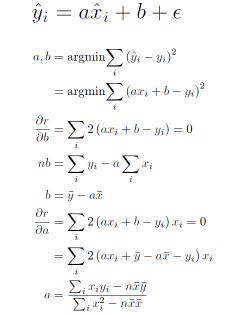

## OLS Map

* Map is what we apply at each point.
* Here is fairly straightforward emit the terms we need to sum.
* (1, x<sub>i</sub>, y<sub>i</sub>, x<sub>i</sub> y<sub>i</sub>, x<sub>i</sub><sup>2</sup>)
* Note that key is 1 - could be anything, just has to be the same everywhere.
* Key is the same because...


```
#!/usr/bin/env python

import sys

for line in sys.stdin:
    line = line.strip()

    words = line.split()
    x = float(words[0])
    y = float(words[1])
    
    count = 1 
    sumx  = x
    sumy  = y
    sumxy = x*y
    sumxx = x*x

    key = "1"
    print '%s\t%f\t%f\t%f\t%f\t%f' % (key, count, sumx, sumy, sumxy, sumxx)

```

## OLS Reduce

* ..only need 1 reducer - reducing everything to just two values
* (*Could* use one reducer for slope, another for intercept, but they need much of the same data - no win).
* Sum up all the individual terms, do very simple processing when all summed received.

```
#!/usr/bin/env python
import sys

count = 0
sumx  = 0
sumy  = 0
sumxy = 0
sumxx = 0
count = 0

for line in sys.stdin:
    line = line.strip()

    key, pcount, psumx, psumy, psumxy, psumxx = line.split()
    count = count + float(pcount)
    sumx  = sumx  + float(psumx)
    sumy  = sumy  + float(psumy)
    sumxy = sumxy + float(psumxy)
    sumxx = sumxx + float(psumxx)
    
covxy = sumxy - (1./count)*sumx*sumy
varx  = sumxx - (1./count)*sumx*sumx
meanx = sumx/count
meany = sumy/count

m = covxy/varx
b = meany - m*meanx

print '%s\t%s' % ("out","y = " + str(m) + " x + " + str(b))


```
## OLS Combine

* Combine is basically just the reduce without the after-sum processing yet.
* Avoids sending unnecessary data across the network - just do the partial sums.
* Note: in streaming mode, could do the partial summing in mapper; but that's an accident of the implementation.
* If need to go beyond streaming interface (binary readers, etc) can't do that any more.

```
#!/usr/bin/env python
import sys

count = 0
sumx  = 0
sumy  = 0
sumxy = 0
sumxx = 0

for line in sys.stdin:
    line = line.strip()

    key, pcount, psumx, psumy, psumxy, psumxx = line.split()
    count = count + float(pcount)
    sumx  = sumx  + float(psumx)
    sumy  = sumy  + float(psumy)
    sumxy = sumxy + float(psumxy)
    sumxx = sumxx + float(psumxx)
    
print '%s\t%f\t%f\t%f\t%f\t%f' % (key, count, sumx, sumy, sumxy, sumxx)

```

## OLS 1D

* Run the example if you haven't already
* Compare it with the speed of running it with cat/map/reduce in the shell, locally
* What are the speed differences, and why (the 'time' command may be useful here)
* How do the results compare as a function of size? (make input/ small-data.dat and change the Makefile to run the hadoop script on the smaller size file).


## OLS 3D

* Should really be OLS 2d
* cd ~/examples/ols/3d!
* make!
* Same basic structure...

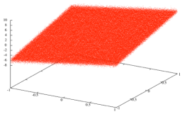


## Multi-d Least-Squares Linear regression

* The generalization of 1d is matrix operations
* X is a matrix of multiple variables (columns) and points (rows)
* One column is all ones (for the constant term)
* Requires a matrix solve for the vector of unknowns 0x03B2

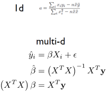


## Multi-D OLS: Map

* map.py isn't that different, except:
    * Can use numpy in the scripts (must be installed on all cluster nodes)
    * X<sup>T</sup>X is generalization of x<sup>2</sup>
    * X<sup>T</sup>y is generalization of x y
* Note we're wasting a lot of time working with numbers and then changing them back and forth to strings - that's just because we're using streaming interface for simplicity.

```
#!/usr/bin/env python
import sys
import numpy

for line in sys.stdin:
    line = line.strip()

    words = line.split()
    x = float(words[0])
    y = float(words[1])
    z = float(words[2])

    xvec = numpy.array([1.,x,y])

    xTx  = numpy.outer(xvec,xvec)
    xTy  = z*xvec

    count = 1
    
    key = "1"
    print '%s\t%d\t%s\t%s' % (key, count, numpy.array_str(xTy).translate(None,'[]\n'), 
                                   numpy.array_str(xTx).translate(None,'[]\n'))

```

## Multi-D OLS: Reduce

* Similarly, reduce.py takes advantage of numpy arrays, "fromstring";
* can use linear algebra package to easily solve for parameters 
* Note that multi-d case is actually shorter than 1d case, and more general.
* Again, combiner is just the reducer without the final solve step.

```
#!/usr/bin/env python
import sys
import numpy
import numpy.linalg

xTx = numpy.zeros((3,3))
xTy = numpy.zeros(3)
count = 0

for line in sys.stdin:
    line = line.strip()

    key, pcount, pxTy, pxTx, = line.split('\t')
    count = count + float(pcount)
    xTy   = xTy + numpy.fromstring(pxTy, sep=' ')
    xTx   = xTx + numpy.fromstring(pxTx, sep=' ').reshape(3,3)
    
params = numpy.linalg.solve(xTx,xTy)
print '%s\t%s' % ("out",numpy.array_str(params))

```

## Nonlinear Least Squares

* However, a lot of scientific computing is inherently iterative
* Have to repeatedly calculate things
* Non-linear least squares - when parameters couple
* cd ~/examples/nlls/mapreduce
* make run-test
* make run
* We choose a very simple method - Gauss-Newton.
* (Not robust enough to use in real work, but simple. More complex methods work work similarly here)
* As with multi-D OLS, this method  comes down to a linear solve, with all the terms in the matrix and vector
just dot products of items easily calculated from the points
* Map - emit f df<sub>i</sub>/da, f df<sub>i</sub>/db, etc 
* Combine/reduce: sum terms (form dot products)Need sum(x),
* Reduce: do linear solve
* Difference: at the end of the linear solve, we don't get the final parameters; we just get an update to
the parameters.


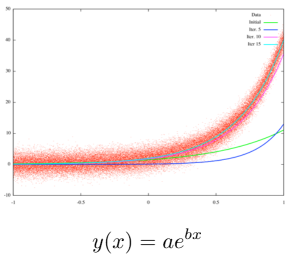

## nlls/Makefile

* Iteration is done in scripting the MR jobs.
* Copy starting parameters into file
* For each iteration,
* Run MR job to update
* copy output into parameter file
* display parameters (for our benefit)
* NITERS job startup overhead:
* Can take several  seconds to start up a job each time; adds up.
* Each map job, new parameters are read in from disk
* Worse: each iteration, map job reads entire data set from disk...
* even though nothing has changed since last time!
* No way to persist data in memory over multiple **MR** jobs
* All persistence is done to disk.
* We'll see better frameworks for handling this type of problem shortly.

```
NITERS=25

run: inputs
    cp orig.params params
    for iter in `seq $(NITERS)`; do \
        hdfs dfs -rm -f -r $(OUTPUT_DIR) ;\
        hadoop jar $(TOOLLIBS_DIR)/hadoop-streaming-$(HADOOP_VERSION).jar \
        -files ./map.py,./combine.py,./reduce.py,./params\
        -mapper ./map.py  -combiner ./combine.py  -reducer ./reduce.py \
        -input $(INPUT_DIR) \
        -output  $(OUTPUT_DIR) ; \
        hdfs dfs -cat $(OUTPUT_FILE) > params; \
        cat params ;\
    done
```

## More Map-Reduce

* The above examples are fairly obvious applications of map + reduce, even if (for NLLS) the original Hadoop MR approach isn't very efficient.
    * MPI equivalent: previous examples could all be done with local computation + MPI_Reduce() operations.
* The functional map + reduce approach can be applied to a large number of technical computing tasks, even ones where the approach isn't so obvious.
* Worth seeing how it works in these cases

## Sparse Matrix multiplication


* cd ~/examples/matmult!
* Reads in matrix name, row, column, value
* Calculate C = AB
* Here A is a permutation matrix and B = A<sup>T</sup>, so should get identity matrix back.

**input/part-00000**

```
A 0 52 1!
A 1 59 1!
A 10 86 1!
A 11 92 1!
A 12 39 1!
A 13 44 1!
A 14 57 1!
A 15 55 1!
...!
B 16 95 1!
B 26 73 1!
B 27 22 1
```

* How will this work in Map- Reduce?
* An often fruitful way to approach this question - what should the reduce step loop like?
* One approach (which an be improved on): have (i,j) be the key.
* The reducer then calculates the dot product of whatever elements were in row i of A and whatever elements were in
column j of B.

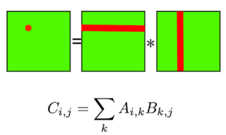

* That means every C<sub>ij</sub> will need A<sub>ik</sub>
* So mapper reading Aik will have to emit key-value pairs (i,j) ("A", i, k, value) for all j.
* Similarly, mapper reading B<sub>kj</sub> will have to emit key value pairs (i,j) ("B", k, j, value) for all values of i.
* Then it's the job of the reducer for (i,j) to find any matching ks in the Alist of items from A, B and dot
product them together.

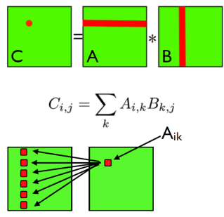

* So mapper reading A<sub>ik</sub> will have to  emit key-value pairs (i,j) ("A", i, k, value) for all j.
* Similarly, mapper reading B<sub>kj</sub> will have to emit key value pairs (i,j) ("B", k, j, value) for all values of i.
* Then it's the job of the reducer for (i,j) to find any matching ks in the Alist of items from A, B and dot product them together.

```
#!/usr/bin/env python

import sys
maxrows=100

for line in sys.stdin:
    line = line.strip()

    matrix, row, col, val = line.split()
    row = int(row)
    col = int(col)
    val = int(val)

    if matrix == 'A':   
        value = matrix+'-'+str(col)+'-'+str(val)
        for j in xrange(maxrows):
            key = str(row)+'-'+str(j)
            print '%s\t%s' % ( key, value )
    else:       
        value = matrix+'-'+str(row)+'-'+str(val)
        for i in xrange(maxrows):
            key = str(i)+'-'+str(col)
            print '%s\t%s' % ( key, value )

```

* So mapper reading A<sup>ik</sup> will have to emit key-value pairs (i,j) ("A", i, k, value) for all j.
* Similarly, mapper reading B<sup>kj</sup> will have to emit key value pairs (i,j) ("B", k, j, value) for all values of i.
* Then it's the job of the reducer for (i,j) to find any matching ks in the Alist of items from A, B and dot product them together.

```
for line in sys.stdin:
    line = line.strip()

    key, value = line.split()
    row, col = key.split('-')
    matrix, index, val = value.split('-')

    row = int(row)
    col = int(col)
    val = int(val)
    index  = int(index)

    if row != currentRow or col != currentCol:
        # new key
        if currentRow is not None:
            # calculate, print results
            matrixElement = calcSum(matAvalues, matBvalues)
            printSum(currentRow, currentCol, matrixElement)
            matAvalues = {}
            matBvalues = {}

        # new currentRow/col
        currentRow = row
        currentCol = col

    # put value in maps
    putValue(matrix, index, val, matAvalues, matBvalues)

```

* Note that efficiency (eg, communications) could be improved by breaking the matrix up into tiles, rather than individual elements (just as with single-node matrix multiplication)
* Note too if you know something about the structure of the sparse matrix (eg, banded diagonal) can do better.


## One-D Diffusion
```
    cd ~/examples/diffuse/
    mapreduce
    make clean
    make!
```

* Implements a 1d diffusion PDE

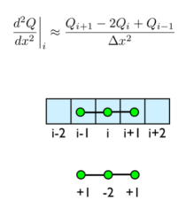

* Inputs:
    * Pre-broken up domain
    * 1d gaussian
    * constant diffusion - should maintain Gaussianity
* What is the map?
* What is the reduce?

```
0: 0.0050365 0.00709477 0.01360237 ...
1: 0.16004214 0.19533521 0.28114455 ...
2: 0.84731875 0.89604445 0.96817042 ...
3: 0.74742274 0.68483447 0.55549607 ...
4: 0.10984817 0.08720647 0.05310277 ...
```
* Key: domain segment
* Value: subarray (numpy)
* What information does the reducer need to update the values?

```
0: 0.0050365 0.00709477 0.01360237 ...
1: 0.16004214 0.19533521 0.28114455 ...
2: 0.84731875 0.89604445 0.96817042 ...
3: 0.74742274 0.68483447 0.55549607 ...
4: 0.10984817 0.08720647 0.05310277 ...
```

* Reducer needs guard cell data - one value from each neighbouring segment.
* Map: Read (segment#,data), send leftmost piece of data to key segment-1, rightmost to segment +1, all data to segment
* Reducer for each segment#: update entire subregion with guardcells.


* Reducer needs guard cell data - one value from each neighbouring segment.
* Map: Read (segment#,data), send leftmost piece of data to key segment-1, rightmost to segment +1, all data to segment
* Reducer for each segment#: update entire subregion with guardcells.

```
#!/usr/bin/env python

import sys
import numpy
from StringIO import StringIO

for line in sys.stdin:
    line = line.strip()
    segment, datastr = line.split(':')

    segment = int(segment)
    data = numpy.genfromtxt(StringIO(datastr))

    # left guardcell
    if (segment > 0):
        print '%d:L%f' % (segment-1,data[0])

    # right guardcell
    print '%d:R%f' % (segment+1,data[-1])
  
    # all data
    print line

```

```
#!/usr/bin/env python

import sys
import numpy
from StringIO import StringIO

def calculate(seg, leftGC, rightGC, data, coeff):
    if seg is not None and data is not None:
        alldata = numpy.append( numpy.append(rightGC, data), leftGC)
        return alldata[1:-1] + coeff*( alldata[0:-2] - 2.*alldata[1:-1] + alldata[2:] )
    else:
        return None

def printData(seg, data):
    if data is not None:
        datastr = numpy.array_str(data)
        datastr = datastr[1:-1]            # strip brackets
        datastr = datastr.replace('\n','') # strip newlines
        print '%d:%s' % (seg, datastr)

dx = 1.
D  = 1.
c  = 0.75
dt = c*dx*dx/(2.*D)
coeff = D * dt / (dx * dx)

currentSegment = None
leftGC = 0.
rightGC = 0.
data = None

for line in sys.stdin:
    line = line.strip()
    segment, datastr = line.split(':')

    segment = int(segment)
    if segment != currentSegment:
        # output previous data 
        if currentSegment is not None:
            updatedData = calculate(currentSegment, leftGC, rightGC, data, coeff)
            printData(currentSegment, updatedData)
 
        # init new segment
        currentSegment = segment
    leftGC = 0.
    rightGC = 0.
    data = None

    firstchar = datastr[0]
    if firstchar == 'L':
        leftGC = float(datastr[1:])
    elif firstchar == 'R':
        rightGC = float(datastr[1:])
    else:
        data = numpy.genfromtxt(StringIO(datastr))

if currentSegment is not None:
    updatedData = calculate(currentSegment, leftGC, rightGC, data, coeff)
    printData(currentSegment, updatedData)

```
* Running - it works!
* Communications-wise, similar to MPI.
* But every iteration involves reading, writing entire domain to disk.


# Part III: Pig

## Apache Pig

* Pig is a high-level scripting dataflow language on top of Hadoop.
* Good for processing data; importing, cleaning, transforming.
* Can use for simple analysis.
* Compiles down to (currently) Map-Reduce; other back ends coming (incl. spark)

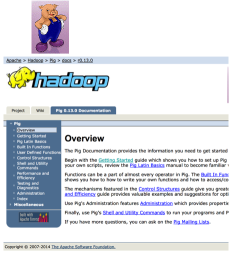

* Dataflow language - data comes in, is repeatedly transformed, goes out.
* *Lazy* evaluation; nothing actually done until results have to be materialized (eg, by the "store" command).
* Lazy evaluation allows large scope for optimization.

```
lines = load 'wordcount-pig/input-large/*' 
        using PigStorage
        as (line:chararray);
words = foreach lines
        generate flatten(TOKENIZE(line))
        as word;
word_groups = group words by word;
word_counts = foreach word_groups
              generate group as word, COUNT(words);
store word_counts into 'wordcount-pig/output';

```

* Let's walk through the word count example in pig:
```
cd ~/examples/wordcount/pig
make inputdir
pig
```
* Then, at the prompt, type in the following lines **except** the store line. 
* Note: pig can be run in interactive mode or batch mode (pig script.pig)
* Can be run on hadoop cluster or locally (pig -x local)

* **Load:** reads in file(s) using a variety of storage systems, and (optionally) parses records into fields.
* Here, we're just loading the entire file into lines, which are strings (arrays of characters - chararray).
* Using default Pig reader from HDFS (PigStorage).

* **Foreach** [dataset] **generate** operates on each row in the input dataset and outputs the transformed data set.
* Here, for each line, we're tokenizing the string (breaking it into words...)
* and "flattening" that new list of tokens (word1, word2, word3) into rows of their own:
    * word1
    * word2
    * word3
    

* Type `describe lines' and `describe words':
```
grunt> describe lines;
lines: {line: chararray};
grunt> describe words;
words: {word: chararray};
```

* Lines is a dataset of rows with one field, a string called line;
* Words is a dataset of rows with one field each, in this case the tokens.

* Group [dataset] by [field] generates a new dataset where each row corresponds to a unique [field] in the original dataset.
* Each row of the output dataset contains a "bag" of rows of the original data set that share that field.

```
grunt> describe words; words: {word: chararray};
grunt> describe word_groups; word_groups: {group: chararray,words: {(word: chararray)}}
```

* Finally, the last line generates the counts. Each row of word_groups has two fields, group which is the common field (eg, the word), and `words' which is the list of words which are the same as word.
* This generates word, count(words) from that.

```
grunt> describe word_counts word_counts: {word: chararray,long}
```

* So far nothing has actually happened yet - machinery doesn't spin into action until asked to produce some output.
* We can ask for a sample of data using the illustrate command:

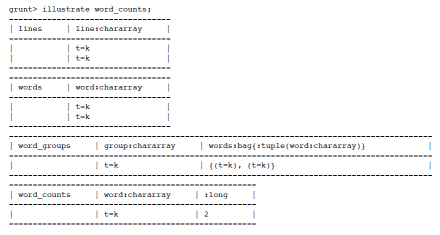

* Demonstrates the whole process; can also do it with the input-small dataset, where it ends up showing the whole data set.

* Can run the same script interactively locally (eg, without putting data on HDFS) with pig -x local;

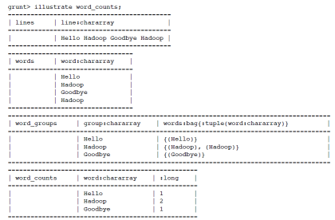

* Might think since we wrote this out as four separate steps in the .pig script file, would run in multiple MR jobs
* But the lazy evaluation allows the building of an optimized execution plan. Run

```
explain word_counts;
```
 
  to find out what is actually run.

* Done in one map/combine/reduce job.
* Doesn't matter much here, but in more complex processing can be a big win.


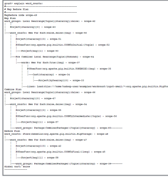

## Apache Pig: 1D OLS

* Here's a pig script to do linear regression.
* Generates (x,y,x<sup>2</sup>,xy)
* Generates count, sums;
* Combines summed terms to m, b
* Outputs result.

```
data    = LOAD 'ols1d/input/data.dat' USING PigStorage('\t') 
               as (x:double, y:double);
allcols = FOREACH data generate x as x, y as y, x*x as xsquared, x*y as xy;
onerow  = GROUP allcols ALL;
sums    = FOREACH onerow GENERATE COUNT(allcols) as n, 
       SUM(allcols.x) as sumx, SUM(allcols.y) as sumy, 
           SUM(allcols.xsquared) as sumxx, SUM(allcols.xy) as sumxy;
params  = FOREACH sums GENERATE (sumxy-sumx*sumy/n)/(sumxx-sumx*sumx/n) as m, 
                sumy/n - sumx/n*(sumxy-sumx*sumy/n)/(sumxx-sumx*sumx/n) as b;
STORE params into 'ols1d/pig-output';

```
## Apache Pig

* To see advantage of higher-level language, let's consider slight generalization of 1d OLS case we saw.
* Let's imagine we're measuring the system in one of two states (which we can't control) and we want to get best fit parameters y = m x + b for each.
* (eg, we have reason to believe m,b aren't same in both).
* Also, noisy equipment; sometimes error occurs and returns outlier values over 100 off in +ve direction.


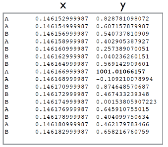


* Here's the more general case.
* All we've done is:
    * Add **FILTER** line to kill off outliers;
    * **GROUP** by **TYPE** to make sure we process the two states separately.
* Programming in a higherlevel language is a huge time saver if it matches your problem.

```
rawdata = LOAD 'olspig1d/input/data.dat' USING PigStorage('\t') as (type:chararray, x:double, y:double);
data    = FILTER rawdata by y < 500;
allcols = FOREACH data generate type as type, x as x, y as y, x*x as xsquared, x*y as xy;
onerow  = GROUP allcols by type;
sums    = FOREACH onerow GENERATE group as type, COUNT(allcols) as n, SUM(allcols.x) as sumx, 
           SUM(allcols.y) as sumy, SUM(allcols.xsquared) as sumxx, SUM(allcols.xy) as sumxy;
params  = FOREACH sums GENERATE type as type, (sumxy-sumx*sumy/n)/(sumxx-sumx*sumx/n) as m, sumy/n - sumx/n*(sumxy-sumx*sumy/n)/(sumxx-sumx*sumx/n) as b;
STORE params into 'olspig1d/pig-output';

```

* Output from running make -get parameters back for each state.
* How do they compare to data.py?
* Running that job interactively and typing "explain params", how does data flow through the program; how many **MR** jobs are launched?

```
$ cd ~/examples/ols/1d-pig
$ make
[.. lots deleted ..]
hdfs dfs -cat /user/hadoop-user/olspig1d//pig-
A  1.9984456929485  0.09945163867270063
B  4.0011290010090  -0.10003840778117842
```

* Note - Pig doesn't have built-in linear algebra routines to help with multi-d OLS, but can create/call User Defined functions to do things like math with other libraries.
* Can write UDFs in Python, sort of.
* Also very nice way to call Pig from Python (`embedded pig').
* Pig doesn't solve the drawback of MR for iterative computations, but can (very shortly will) have other back ends...

# Part IV: YARN, Spark

## Hadoop 0.1x

* Original Hadoop was basically HDFS and infrastructure for MapReduce
* Very faithful implementation of Google MapReduce paper.
* Job tracking, orchestration all very tied to M/R model
* Made it difficult to run other sorts of jobs

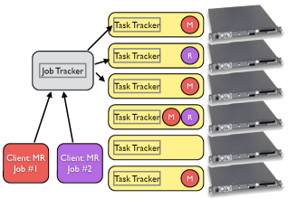

## YARN and Hadoop 2

* YARN: Yet Another Resource Negotiator 
* Looks a lot more like a cluster scheduler/resource manager
* Client requests resources for application manager;
* AppMgr then requests resources from the Resource Manager, does the job orchestration.
* Allows arbitrary jobs.
* Map Reduce looks the same to the programmer, behaves differently under the hood.
* MR is now just another sort of App manager.
* AM requests mappers near the data; is given containers on nodes.
* AM figures out number of reducers, requests resources for them, too.
* This new infrastructure allows for essentially arbitrary types of jobs. 
* eg, several projects exist to have MPI jobs running on a YARN cluster.
* (Other such cluster schedulers exist; Mesos is another. Important differences don't concern us here.)


* A number of new compute/data tools make use of the new more flexible infrastructure.
* Several potentially of significant interest to numerical computing.
* We'll talk about Apache Spark, but others (Flink, ...)
* Also, all the usual data-handling platforms (NoSQL databases, etc) potentially useful in other scientific contexts.


## Apache Spark

* Developed at AMPLab at UCBerkeley
* Apache project since June 2013
* Native language is JVM-based Scala, but excellent Python support
* Key feature - in-memory analyses.
* Includes libraries for sql database, streaming data processing, machine learning


## RDD

* Key data structure: Resilient Distributed Dataset (RDD)
* Partitioned collections (lists, maps..) across nodes
* Set of well-defined operations (incl map, reduce) defined on these RDDs.


* Fault tolerance works three ways:
    * Storing, reconstructing lineage
    * Replication (optional)
    * Persistance to disk (optional)


## RDD Lineage

* Map Reduce implemented fault tolerance by outputting everything to disk always.
* Effective but extremely costly.
* How to maintain fault tolerance (for truly large-scale analyses) without sacrificing in-memory performance?
* Record lineage of an RDD (think version control) 
* If container, node goes down, reconstruct RDD from scratch
* Either from beginning, or from (occasional) checkpoints which user has some control over. 
* User can suggest caching current state of RDD in memory, persisting it to disk, or both.
* Can also save RDD to disk, or replicate partitions across nodes for other forms of fault tolerance.

**RDD from disk + map1 + map2 = current RDD**

## Why still map, reduce?

* Number of operations available on RDDs
* Many look like MR or Pig operations. 
* Familiar (to Hadoop community) operations that are quite powerful..
* .. and that make it easy to reason about, reconstruct, lineage.
* Other operations with that property are possible.

```
map(func)
filter(func)
flatMap(func)
mapPartitions(func)
mapPartitionsWithIndex(func)
sample(withReplacement, fraction, seed)
union(otherDataset)
intersection(otherDataset)
distinct([numTasks]))
groupByKey([numTasks])
reduceByKey(func, [numTasks])
sortByKey([ascending], [numTasks])
join(otherDataset, [numTasks])
cogroup(otherDataset, [numTasks])
cartesian(otherDataset)
pipe(command, [envVars])
coalesce(numPartitions)
repartition(numPartitions)
```

## PySpark

* Whoops: messed up link in examples.
* cd ~/examples/wordcount/spark
* cp ~/spark-1.0.2-bin-hadoop2/examples/src/main/python/wordcount/wordcount.py wordcount-spark.py
* make

## PySpark - Wordcount

* Recognizably same logic as MapReduce..
* But much more concise. 
* SparkContext(): create Spark Context (connect to cluster, get config, etc).
* sc.textFile() - read in text file partitioned across spark tasks
* flatMap - like Generate followed by Flatten in Pig: 
    * Map each line to potentially many items (with split)
    * Expand those each out to their own row.


```
if __name__ == "__main__":
    if len(sys.argv) != 2:
        print >> sys.stderr, "Usage: wordcount <file>"
        exit(-1)
    sc = SparkContext(appName="PythonWordCount")
    lines = sc.textFile(sys.argv[1], 1)
    counts = lines.flatMap(lambda x: x.split(' ')) \ .map(lambda X: (X, 1)) \ .reduceByKey(add)
    output = counts.collect()
    For (word, count) in output:
        print "%s: %i" % (word, count)
```

* Map word ->(word,1)
    * old friend now.
* reduceByKey: just like MapReduce reduce
* The reduction operation is addition
* collect brings all the output to the driver
* Then print it out.
* Spark-submit: submit spark job to a yarn cluster, or a spark standalone (dedicated) cluster
* Or run locally.
* Here, run with 2 workers.

```
run: inputdir
    spark-submit --master yarn[2] ./wordcount-spark.py $(INPUT_DIR)/astro_02 | sort -n -t: -k2

run-local: 
    (unset HADOOP_CONF_DIR; \
     unset SPARK_YARN_USER_ENV; \
     spark-submit --master local[2] --deploy-mode client ./wordcount-spark.py ./input/astro_02 | sort -n -t: -k2 )
```


## Calculating Pi

* Another common parallel computing example, and spark example.
* Start up pyspark interactively:

```
$ pyspark
...
```

* And type in the following program.
* Interactively (pyspark), spark context is already defined for you.
* Parallelize an nbins-sized collection;
* For each element run a random test to calculate the area of a circle compared to a square
* And sum the results. 
* Play with changing nbins.

```
from random import random
from operator import add

nbins = 100000

def circleTry(i):
x = random() * 2 - 1
y = random() * 2 - 1
return 1 if x ** 2 + y ** 2 < 1 else 0

count = sc.parallelize(xrange(nbins), 2)\ .map(circleTry).reduce(add)
print "Pi is roughly %f" % (4.0 * count / n)

```

## Nonlinear-least squares

* Problem with Map-Reduce NLLS - entire data set was reread from disk every iteration.
* In MPI, etc, we'd just distribute it in memory over nodes, keep it in memory and iteratively improve parameters.
* For large data sets (exactly what Hadoop is supposed to do), going to disk each time far too expensive.


* Let's go to
    * ~/examples/nlls/spark
* and look at the Makefile, then the main loop of nlls-spark.py:

## NLLS: Spark

* Makefile - just submit a job.
* No iteration at this level.

```
run: inputs
spark-submit --master yarn[2] ./nlls-spark.py \ $(INPUT_DIR)/data.dat 1.5 2.0 $(NITERS)
```

## Nonlinear-least squares

```
points = sc.textFile(sys.argv[1])\ .mapPartitions(readPointBatch).cache()
parama = float(sys.argv[2])
paramb = float(sys.argv[3])
iterations = int(sys.argv[4])

w = np.array([parama, paramb])

#. . .

print "Initial w: " + str(w)
for i in range(iterations):
    grad,JtJ = points.map(lambda m: gradient(m,w))\ .reduce(add)
    dw = np.linalg.solve(JtJ, -grad)
    w += dw*0.5
    print i, w
```

* Read in the data file once, and cache() it in main memory.
* Then, loop over iterations
* Each step, calculate derivatives at each point
* Reduce them to the terms of the gradient and J<sup>T</sup>J
* Do the linear solve (numpy) and update the parameters
* Run make.
* Initial job startup still slow: copying file in (would normally already be there)
* Starting up spark job (like starting a batch job)
* Once computations start, very fast.
* As with pig, can run locally (make run-local)

```
def gradient(matrix, w):
        X = matrix[:, 0]
        Y = matrix[:, 1]

        expbt = np.exp(w[1]*X)
        f = Y - w[0]*expbt
        dfda = -expbt
        dfdb = -w[0]*X*expbt

        grad = np.array([np.sum(f*dfda), np.sum(f*dfdb)])
        JtJ  = np.array([[np.sum(dfda*dfda), np.sum(dfda*dfdb)],
                            [np.sum(dfda*dfdb), np.sum(dfdb*dfdb)]])
        return (grad, JtJ)

    def add(x, y):
        return (x[0]+y[0], x[1]+y[1])    

```

* gradient - just as before
* Add - separately sums the two components being reduced: the numpy array grad and the numpy array JtJ.

```
def readPointBatch(iterator):
    strs = list(iterator)
    matrix = np.zeros((len(strs), D))
    for i in xrange(len(strs)):
        matrix[i] = np.genfromtxt(StringIO(strs[i]))
    return [matrix]
```

```
 sc = SparkContext(appName="PythonNLLS")
    points = sc.textFile(sys.argv[1]).mapPartitions(readPointBatch).cache()
```

* readPointBatch:
* The textile gets read in, and this function is applied on each partition
* Converts the entire local data into one numpy array 
* Makes doing the residual calculations very fast (numpy operations)

## 1d Diffusion

* Again, the issue here was that reading/writing to disk each time was incredibly slow. 
* We do in fact want to write output of these simulations out to disk every so often (checkpoint), just not every
iteration.


* We could do this the same way
* we did it in Map-Reduce, but let's do it in a more idiomatic way for MR, Spark:
* (key, value) is (index, temperature)
* At each index we need values from neighbouring index..


* So for each value, emit
    * (idx, temp), (idx, -2c * temp), (idx-1, -c\* temp), (idx+1,-c* temp) 
* And then reduceByKey (sum)!


* The stencil map function:
* Emit the local value and the stencil coefficients
* Use filter to not go off of grid (only interior points)

```
def interior(ix):
     return (ix[0] > 0) and (ix[0] < ncells-1)
    
def stencil(item):
        i,t = item
        vals = [ (i,t) ] 
        cvals = [ (i, -2\*coeff\*t), (i-1, coeff\*t), (i+1, coeff\*t) ]
        return vals + filter(interior, cvals)
```

* Then main loop is easy:
* Calculate ICs (even easier would have been to read them from a file)
* Parallelize (eg, partition) the data
* For each iter,
    * Map - emit the stencil bits
    * Reduce - sum the coefficients at each point.
    
```
temp = map(tempFromIdx,range(ncells))
    data= sc.parallelize(temp).partitionBy(nprocs, lambda k:k*nprocs/ncells)
    print "IC: "
    print data.collect()
    for step in xrange(nsteps):
        print step
        stencilParts = data.flatMap(stencil)
        data = stencilParts.reduceByKey(lambda x,y:x+y)
    print "Final: "
    print data.collect()
```

## Hadoop 2+

* "Classic" Hadoop 1.x was all about batch processing of massive amounts of data in one or few passes.
* Current Hadoop expands capabilities significantly. 
* Seen Spark, but also Pregel/Giraph for general, MPI-like communications patterns
* Also enormous data processing capabilities, batch + interactive.


* An increasingly important tool for quantitative researchers to have at their disposal


## Questions?

### First hands-on

* More to get you into the mode of writing Java 
* We have the same example in wordcount-worksheet, but with the guts of map, reduce left out.
* Practice writing the code. Feel free to google for how to do things in Java, but don't just blast the lines from
examples...
* Can use your favourite local editor and scp file to VM

```
  public static class Map 
      extends Mapper<Object, Text, Text, IntWritable> {

    private final static IntWritable one = new IntWritable(1);
    private Text word = new Text();

    @Override
    public void map(Object key,
                    Text value,
                    Context context) 
        throws IOException, InterruptedException {
      String line = value.toString();
      StringTokenizer tokenizer = new StringTokenizer(line);
      while (tokenizer.hasMoreTokens()) {
        word.set(tokenizer.nextToken());
        context.write(word, one);
      }
    }
  }

  public static class Reduce 
    extends Reducer<Text, IntWritable, Text, IntWritable> {

    @Override
    public void reduce(Text key,
                       Iterable<IntWritable> valueList,
                       Context context)
           throws IOException, InterruptedException {
      int sum = 0;
      Iterator<IntWritable> values = valueList.iterator();
      while (values.hasNext()) {
        sum += values.next().get();
      }
      context.write(key, new IntWritable(sum));
    }
  }
   
```

* To copy files back and forth, find the IP a of the VM
* (We enabled this in virtualbox with the IO APIC/Adapter 2 stuff) 
* vagrant/vagrant

**VM**

```
$ ifconfig | grep 192!
inet addr: 192.168.33.10 [...]
```

**Host**

```
$ scp WordCount.java vagrant@192.168.33.10:!
vagrant@192.168.33.10's password: vagrant
```

## Beyond WordCount

* Let's start going a little bit beyond simple wordcount 
* cd ~/inverted-index 
    * make run
* First, take a look at word count broken down by document
* 5 new papers each from 8 disciplines, taken from arxiv, pdftotext


## WordCount by Doc

* Map is a little more  sophisticated - strips out "stop words" (the, and ...)
* Also only pay attention to "words" > 3 letters (strip out noise from pdf-to-text conversion - eqns, etc)

```
public void map(Object key, Text value, Context context) 
    throws IOException, InterruptedException {

    FileSplit filesplit =(FileSplit)context.getInputSplit();
    String fileName=filesplit.getPath().geyName();

    String line=(value.tostring()).replaceAll("[a^z\\sA-Z]")

    StringTokenizer tokenizer= new StringTokenizer(line);
    if( (!stopwords.contains(newWord)) && (newWord.length()))
        word.set(fileName +" " + newWord);
    context.write(word,one);
}
```

*  Mapper: while the value here is still one, the key is now filename + " " + word
*  (why?)


```
public void map(Object key, Text value, Context context) 
           throws IOException, InterruptedException {
    FileSplit filesplit =(FileSplit)context.getInputSplit();
    String fileName=filesplit.getPath().geyName();

    String line=(value.tostring()).replaceAll("[a^z\\sA-Z]")

    StringTokenizer tokenizer= new StringTokenizer(line);

    while(tokenizer.hasMoreTokens())
    {
        String newWord = (tokenizer.nextToken()).toLowerCase();
        if( (!stopwords.contains(newWord)) && (newWord.length()))
            word.set(fileName +" " + newWord);
        context.write(word,one);
    }
}
```

* Reducer is exactly the same

```
public static class Reduce
       extends reducer<Text, InWritable, Text, InWritable>{

    @override
    public void reduce(Text Key,Iterable<Inwritable> valueList,Context context) throws IoException, InteruptedException {

    int sum=0;
    Iterator<Inwritable> values= valueList.iterartor();
    while(values.hasNext()){
        sum +=values.next().get();
    }
     context.write(key, new Inwritwble(sum));
     }
}
```

## Inverted Index:

* Want to use this as a starting point to build an  inverted index
* For each word, in what documents does it occur?
* What is going to be the key out of the mapper? The value?
* What is going to be the reduction operation?


## Hands on:

* Implement the inverted index
* For now, don't worry about repeated items
* InvertedIndex.java 
* Test with `make runinverted`


##Document Similarity

* Wordcount-by-document:
* "Bag of words" approach
* Document is characterized by its wordcounts
* Can find similarity of two  documents through normalized dot product of their vector representation.


* cd ~/document-similarity  ; make
* Wordcount-by-document:
* "Bag of words" approach
* Document is characterized by its wordcounts
* Can find similarity of two documents through normalized dot product of their vector representation.


* So taken the bags-of-words as a given, how do we do the computation?
* What's the map phase, and the reduce phase?
* Easiest to think about the reduce phase first.
* What is going to be the single computation done by a single reducer?
* And what information does it need to perform that computation?

## Document Similarity:Reducer
* The single piece of computation that needs to be done at the reduce stage are the matrix elements Sa,g.
* The computation is straightforward.
* What is the key?
* What data does it need?
  
**Reducer**  


## Document Similarity:Mapper
* It's the mapper's job to read in the data and direct it to the correct reducer by setting the key
* So mapper reads in (astro_01, "abstract 1").
* Which reducer needs that information?


* Map phase: "broadcast" (astro_01, "abstract 1") to all key pairs that will need astro_01
* key: "astro_01 x", x=astro_02, astro_03, ...genomics_01,...
* value: "astro_01 abstract 1"
* (We're just putting everything in text strings here but we could have keys and values which were tuples...)


## Document Similarity:Reducer
* Reducer: Collect all (say)
"astro_01 genomics_03" keys
* Sort into elements for the two documents
* Calculate the result


## Document Similarity:Mapper

* Map: loop over documents
* emit value for each document pair

```
public void map(Object key,
               Text value,
               Context context) 
   throws IOException, InterruptedException {
   String line=value.toString().trim();
   String[] items=line.split("\\s+");
   String doc = items[0];

   for( String otherdocs :documents){
   Text docpair =new Text();
   int order=otherdocs.compareTo(doc);
   if (order < 0){
       docpair.set(otherdocs + " " +doc);
       context.write(docpair, value);
   }else if (order >0){
       docpair.set(docs + " " +otherdoc);
       context.write(docpair, value);
   }
  }
}
```

## Document Similarity:Reducer

* Reducer:
   * Put values into appropriate sparse vector
   * (Parsing is just because we're using text for everything, which you really wouldn't do)
* Then the computation is easy.

```
public void reduce(Text key,Iterable<Text> valueList,Context context)throws IOException, InterruptedException {
    Double sum=0.0;
    String docs[]=(key.toString()).split("\\s+");
    HashMap<String,Double> doc1words= new HashMap<String,Double();
    HashMap<String,Double> doc2words= new HashMap<String,Double();
    Iterator<Text>values=valueList.iterator();

    while(values.hasNext()) {
        String line=values.next().tostirng().trim();
        String terms[]= line.split("\\s+");

        if(terms.length !=3) continue;

        String docname=terms[0];
        String word= terms[1];
        Double count =Double.parseDouble(terms[2]);

        if(docname.equals(docs[0])) {
            doc1words.put(word, count);
        } else {
            doc2words.put(word, count);
        }
       }
        Double doc1mag =0;
        Double doc2mag =0;

        for(Double value : doc1words.values()) {
            doc1mag += value*value;
        }
        doc1mag =Math.sqrt(doc1mag);

        for( Double value :doc2words.values()) {
            doc2mag += value*value;
        }
        doc2mag =Math.sqrt(doc2mag);


        for(String word : doc1words.KeySet()) {
        if(doc2words.containKey(word)) {

            sum += doc1words.get(word)*doc2words.get(word);
            }
          }
            context.write(key, new DoubleWritable(sum/(doc1mag*doc2mag)));
}
```


## Document Similarity: But where did we get..  

* But we need as input:
    * The wordcounts by document
    * The list of documents
* Where do they come from?

```
    astro_01 {abstract:1, galaxy:1, supernova:1, star:1}
    genomics_03 {abstract:1, gene:1, expression:1, dna:1}
```
```
    "astro_01","astro_02","astro_03","astro_04","astro_05","cell_bio_01","cell_bio_02","cell_bio_03","cell_bio_04","cell_bio_05","computational_finance_01","computational_finance_02","computational_finance_03","computational_finance_04","computational_finance_05","crypto_01","crypto_02","crypto_03","crypto_04","crypto_05","databases_03","databases_04","databases_05","databases_01","databases_02","genomics_01","genomics_02","genomics_03","genomics_04","genomics_05","pdes_01","pdes_02","pdes_03","pdes_04","pdes_05","robotics_01","robotics_02","robotics_03",
        
```

* Chains of Map-Reduce Jobs!
* 1st pass - wordcounts,
document list
* 2nd pass - similarity scores
* Can do this programatically (within main), or just by running 2 hadoop jobs...


* Chains of Map-Reduce Jobs!
* 1st pass - wordcounts
* 2nd pass - similarity scores


```
    BASE_DIR = /user/$(USER)/document-similarity/
    INPUT_DIR = $(BASE_DIR)/input
    INTERMEDIATE_DIR =$(BASE_DIR)/intermediate
    OUTPUT_DIR =$(BASE_DIR)output
    OUTPUT_FILE =$(OUTPUT_DIR)/part-00000

    run:wordcount.jar similarity.jar
        hadoop dfs -test -e $(INPUT_DIR)/ \
           || hadoop dfs -put input $(BASE_DIR)
        hadoop jar wordcount.jar org.hpcs2013.wordcount\
            $(INPUT_DIR) $(INTERMEDIATE_DIR)
        hadoop jar similarity.jar org.hpcs2013.similarity\
             $(INTERMEDIATE_DIR) $(OUTPUT_DIR)
        hadoop dfs -cat $(OUTPUT_FILE) | sort -n -k 3

```

## A note on similarity
* Ignore the normalization for a second
* Just the dot products
* What we've done is a sparse matrix multiplication entirely in Hadoop.

    **S<sub>i,j</sub> =w<sub>i</sub> . w<sub>j</sub>  
   S =WW<sup>T</sup>**  
